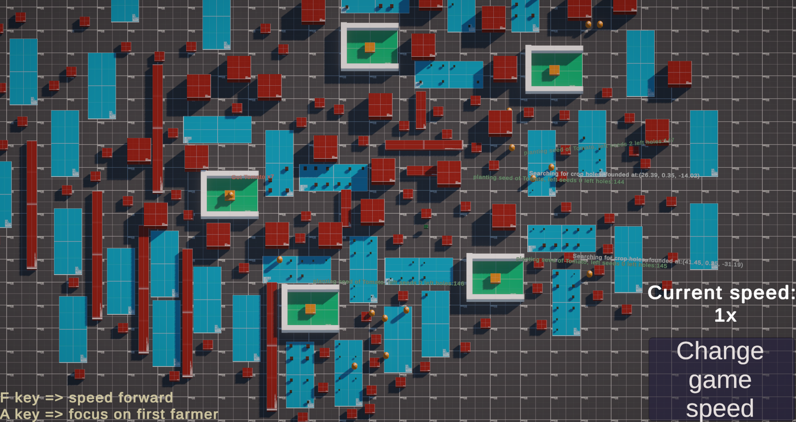
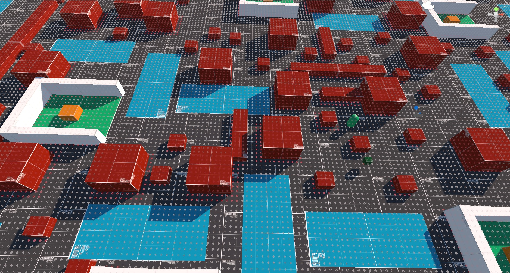
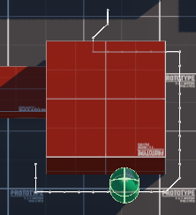
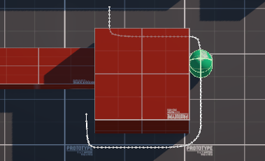
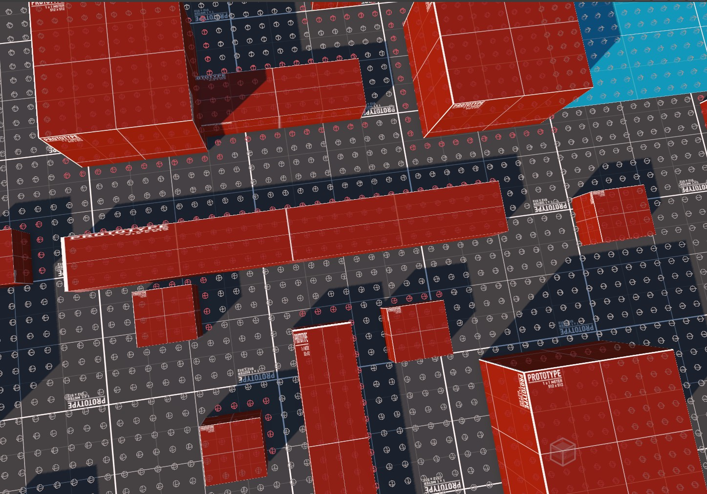
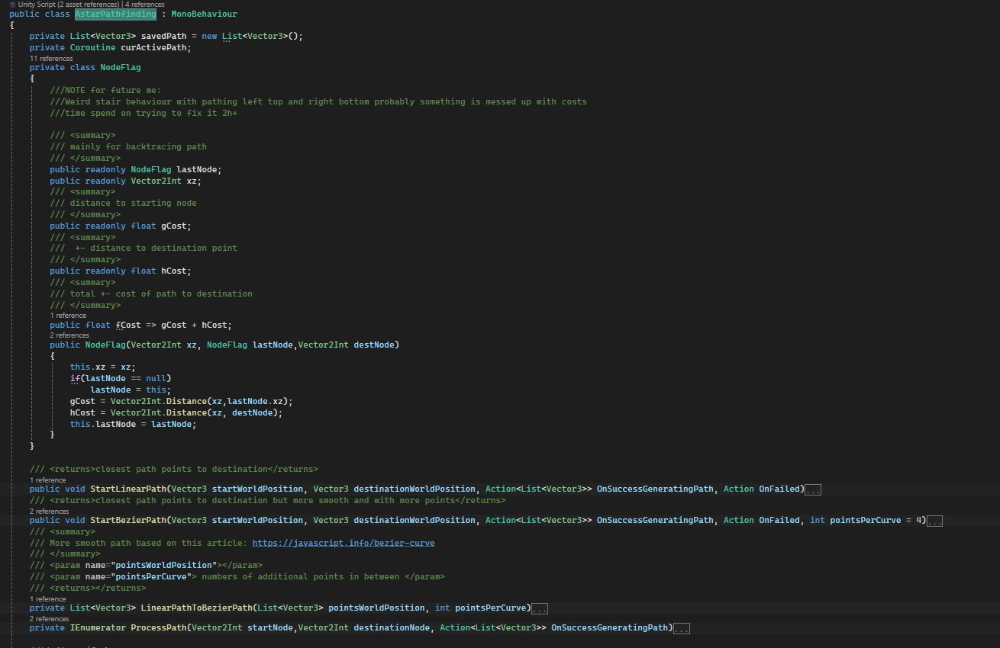

# Farmer Simulation  
## Project Overview   

This project aimed to demonstrate the concept of complexity in simplicity and scalability.  
It showcases my ability to create efficient and adaptable code, even for complex projects.  

### Key Features  

#### A Pathfinding:*  
* Isolated pathfinding system using assembly definitions  
* Customizable grid sizes and center points, large scale friendly  

* Flexible path types (sharp linear or smooth bezier curve)  
Linear:__________________________Bezier curve: 

* Automatic obstacle mapping for squares and rectangles  

* Fully documented  

#### Camera Controls:  
* Boundaries and zooming  
* Farmer following  
* Drag-to-move  
* Perspective and orthographic camera modes  
#### Multiple Farmer AI:  
* Open-ended AI system for future actor types  
* Realistic farmer behavior with limited inventory and work interactions  
* State machine-based AI with 8 distinct states that are:  
-Deploy crops state => if wanna transition to planting or have maximum capacity of seeds  
-Deploy seeds state => if wanna transition to collecting crops or doesnt have seeds and want to plant  
-Find empty crop ground state => if wanna plant seed but isn't near planting spot  
-Find grown crop => if wanna collect crop but isn't near that crop spot  
-Gather crops state => if wanna collect crop that is standing on  
-Gather seeds state => if is near chest that giving seeds and wanna collect seeds  
-Plant state => if wanna plant seeds and is in empty crop ground place  
-Wait for new work => if there is no work to do or something went wrong, safe state  
#### UI  
* Debugging friendly with text popups
* Ability to change simulation speed in runtime
* Visual showcase of farmers job statistics

#### Technical Details:  
Packages: URP, DOTween, GridBox Prototype Materials, TextMeshPro  
Custom Features: A* pathfinding, camera controls, multiple farmer AI, UI  

####  Future Plans:  
Add new types of plants  
